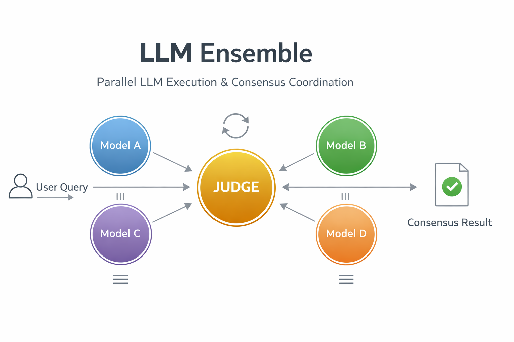

# LLM Ensemble



A Python library for achieving consensus across multiple Agents.

## Features

- **Consensus**: Uses a moderator to iteratively coordinate multiple LLMs until consensus is reached
- Can use any model API based model such as OpenAI, Anthropic, Gemini, Grok supported by Langgraph
- Supports web search for real-time data 

## Installation

```bash
uv add multi-llm-consensus
```

Or install from source:

```bash
git clone https://github.com/zzzrbx/llm-ensemble.git
cd llm-ensemble
uv sync
```

## Environment Setup

Create a `.env` file with your API keys, for example:

```bash
OPENAI_API_KEY=your_openai_key
ANTHROPIC_API_KEY=your_anthropic_key
GOOGLE_API_KEY=your_google_key
XAI_API_KEY=your_xai_key
TAVILY_API_KEY=your_tavily_key  # For web search
```

You must provide at least two API keys for the models you want to use in the ensemble.

## How It Works

```
User Query → Judge (configurable, default: Claude Opus 4.5)
    ↓
Judge calls run_llms tool
    ├── Model A (parallel)
    ├── Model B (parallel)
    ├── Model C (parallel)
    └── Model D (parallel)
         ↓
Judge analyzes responses
    ├── Consensus? → Return answer
    └── No consensus? → Refine query and call run_llms again
         ↓
Repeat until consensus or limit reached
```

**Key Features:**
- **Dynamic queries** - Judge crafts different prompts each iteration:
  - Iteration 1: Sends initial question with research instructions
  - Iteration 2+: Summarizes agreements, highlights disagreements, requests refinements
  - Final iteration: Presents refined consensus statement for confirmation
- **Error handling** - Returns default values on timeout or tool call limit reached

**Tools currently available for LLMs:**
- `search_the_web` - Tavily web search for current events and factual data
- `add`, `subtract`, `multiply`, `divide` - Math operations


## Examples

### Example 1: With structured output

```python
from typing import TypedDict
from llm_ensemble import Consensus

class UserSchema(TypedDict):
    consensus: bool
    final_answer: str
    notes: str

consensus = Consensus(
    models=[
        "openai:gpt-5-mini",
        "google_genai:gemini-3-flash-preview",
        "anthropic:claude-3-5-haiku-20241022",
        "xai:grok-3-mini",
    ],
    response_schema=UserSchema
)

result = consensus.invoke(
    "If survival is arbitrary, is moral judgment arbitrary too?"
)

print(f"Consensus: {result['consensus']}")
print(f"Answer: {result['final_answer']}")
print(f"Notes: {result['notes']}")
```

### Example 2: No structured output with web search enabled (you just need to mention it in the prompt)

```python
from llm_ensemble import Consensus

# No response_schema - returns full agent result
consensus = Consensus(
    models=[
        "openai:gpt-5-mini",
        "google_genai:gemini-3-flash-preview",
        "anthropic:claude-3-5-haiku-20241022",
        "xai:grok-3-mini",
    ]
)

result = consensus.invoke(
    "What are the latest developments in quantum computing?\n\n"
    "Use the web search to research current news and breakthroughs."
)

# Access full agent result
print(result['messages'][-1].content)
```

## Debugging and Observability

The library integrates with LangSmith for trace observability. Set `LANGSMITH_API_KEY` and `LANGSMITH_PROJECT` in your `.env` file to enable tracing.

## License

MIT License

## Contributing

Contributions are welcome! Please open an issue or submit a pull request.


